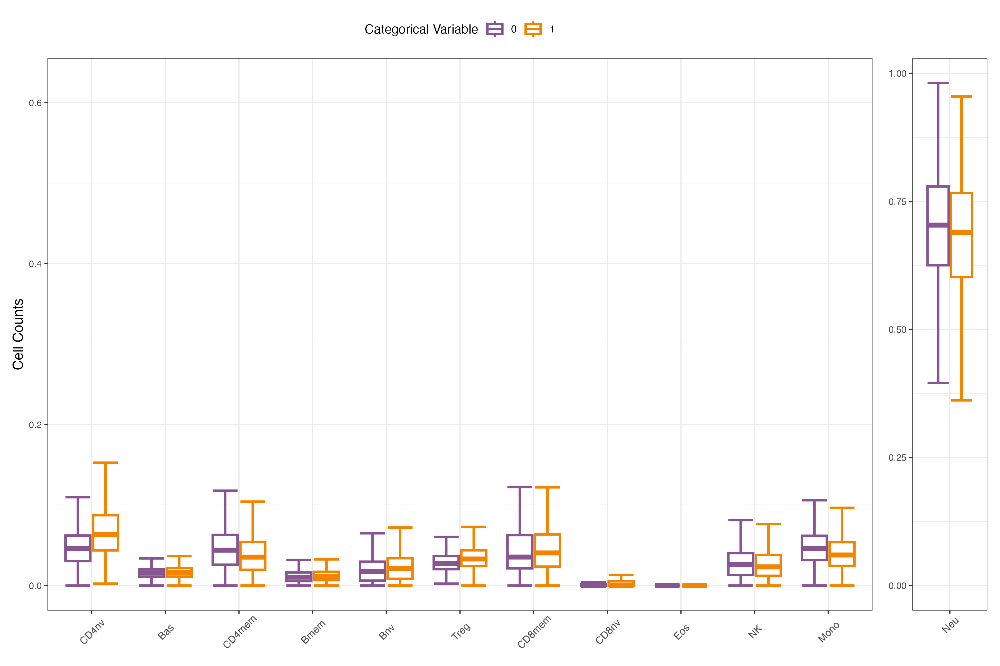
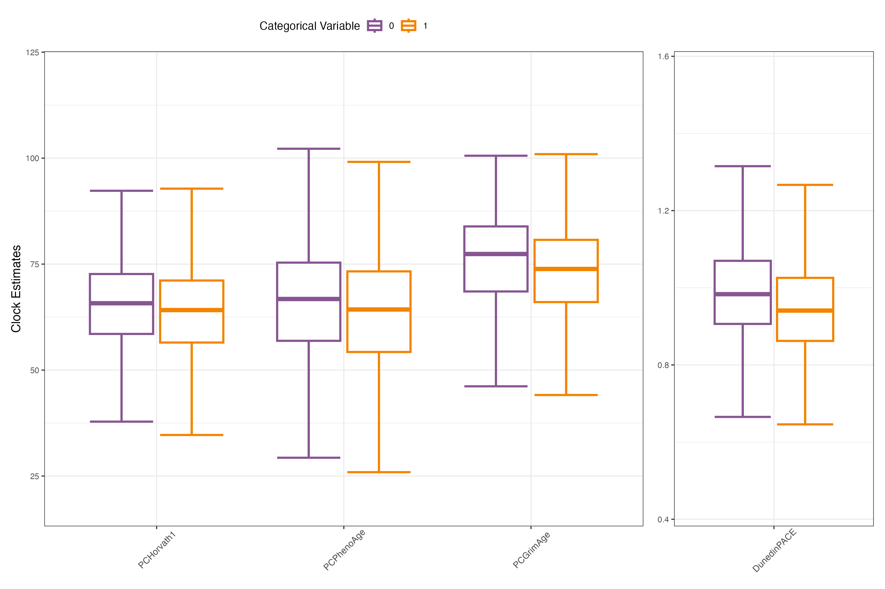

# cellclockr

##### Calen Ryan, PhD and Will Marella, MPhil

## Table of Contents
- [Introduction](#introduction)
- [Quick Start Installation](#quick-start-installation)
- [Requirements](#requirements)
  - [Computational Requirements](#computational-requirements)
  - [Data Requirements](#data-requirements)
- [Functionality](#functionality)
  - [stratified_boxplots_cells](#stratified_boxplots_cells)
  - [stratified_boxplots_clocks](#stratified_boxplots_clocks)
  - [calculate_r2_w_age](#calculate_r2_w_age)
  - [calculate_delta_r2_for_continuous](#calculate_delta_r2_for_continuous)
  - [calculate_univariate_correlations](#calculate_univariate_correlations)
  - [calculate_cell_clock_delta_r2](#calculate_cell_clock_delta_r2)
  - [exposure_cell_clock_associations](#exposure_cell_clock_associations)
  - [exposure_clock_association_with_without_cells](#exposure_clock_association_with_without_cells)
- [Contact](#contact)

## Introduction

`cellclockr` is designed to streamline the analysis of associations between epigenetic clocks and immune cell composition across various exposures and contexts. It allows us to harmonize data products across studies without requiring our collaborators to share raw data. 

The package supports data preparation, model fitting, and output generation, including stratified analyses and visualizations. It is built in R and relies on a minimal set of well-established packages to ensure broad compatibility. 

This document supports the accompanying package. It guides users through the setup and requirements, provides instructions to run each included function, and displays example output.

If you would rather temporarily share your data and have us perform the analysis, please contact Calen Ryan (cpr2139\@cumc.columbia.edu), Will Marella (wm2530\@cumc.columbia.edu), or Dan Belsky (db3275\@cumc.columbia.edu).


## Quick start installation

If you don't already have the `devtools` package installed, install it now

```r
install.packages("devtools")
```

Load the library on your instance of R  

```r
library(devtools)
```

Install the `cellclockr` package  

```r
install_github("CPRyan/cellclockr")
```

## Requirements

### Computational Requirements

This pipeline was constructed in R version 4.4.1 -- All versions 2023-06-16 or later should be compatible with the packages used.

An effort was made to minimize the use of unusual or uncommon packages. Nevertheless, the analysis relies on certain packages that must be installed prior to execution.

-   `dplyr`: Used for easy data manipulation
-   `tidyr`: Used for easy data manipulation
-   `ggplot2`: Used for data visualization and plot generation
-   `patchwork`: Used for patching together several figures easily
-   `broom`: Used for cleaning up model outputs and make them 'tidy'
-   `rlang`: Used for its tools for working with core language features of R
-   `xfun`: Used to create output directories

Please ensure these packages are installed prior to analysis.

### Data Requirements

The analysis in the package requires a dataframe containing columns with the following information:

- Epigenetic clock measures (e.g. Horvath, PCPhenoAge, DunedinPACE, etc.)
- Estimated cell composition measures (e.g. Bcell, CD4Tnaive, etc.)
- Chronological age (optional, but used in most functions)
- (Optional) Groups of interest with one or more categories (e.g. sex, self-reported ethnicity, disease status, etc.)
- (Optional) Continuous variables of interest (e.g. BMI, SES, etc.)
- (Optional) Covariates to control for unwanted technical variation (e.g. Batch, Array, Plate, Row, Column etc.)

## Functionality

The package contains 8 core functions that can be used to generate many results from cells and clocks data. 

`?help` windows are available for each function. To access them, run `?function_name` for the given function. This help window will enumerate all of the arguments available for the function and their correct format. It will also provide a brief description and example use.

### stratified_boxplots_cells

This function creates boxplots for cell types and a summary table of boxplot parameters for the entire dataset. If categorical variables are provided, the output will be stratified by levels in each categorical variable.

Usage: 
```r
cell_boxplots <- stratified_boxplots_cells(
  data,
  id,
  study,
  cell_types,
  highlighted_cell_types = NULL,
  categorical_variables = NULL,
  colors = NULL,
  output_dir = NULL,
  save_plots = FALSE,
  save_summaries = FALSE
)
```

The example below uses default colors and is stratified by "Categorical Variable" which has two levels. "Neu" was selected as a highlighted cell type due to the difference in its scale relative to the other cell types.



If you are unhappy with the colors, you are able to add your own. You may wish to set your desired color palette at the beginning of your script. Then, you can add it easily by setting the `colors` argument equal to your defined palette (`colors = my_color_palette`). 

Summaries are also saved if `save_summaries=TRUE`, and contain the basic quantities associated with each plot. The heading from this example would be structured as:

| Cell Type | Categorical Variable | ymin | lower | middle | upper | ymax |
|-----------|----------------------|------|-------|--------|-------|------|
| ...       | ...                  | ...  | ...   | ...    | ...   | ...  |

These summaries are stored separately for each plot. So in this example, with a single categorical variable input, two plots and two summaries will be generated, if requested.

Since no output directory was provided (`output_dir=NULL`), two folders will be created in the current working directory to save the files, as was requested: cellclockR_output/Plots and cellclockR_output/Summaries for the plots and their respective summaries. Plots are saved as .png, summaries as .csv.


### stratified_boxplots_clocks

This function creates boxplots for clocks and a summary table of boxplot parameters for the entire dataset. If categorical variables are provided, the output will be stratified by levels in each categorical variable.

Usage:
```r
clock_boxplots <- stratified_boxplots_clocks(
  data,
  id,
  study,
  all_clocks,
  highlighted_clocks = NULL,
  categorical_variables = NULL,
  colors = NULL,
  output_dir = NULL,
  save_plots = FALSE,
  save_summaries = FALSE
)
```

The example below contains the clock boxplot, stratified by the same two-level categorical variable, "Categorical Variable." Because the scale of DunedinPACE differs substantially from the other epigenetic clocks, it was included in `highlighted_clocks` to plot on a separate y-axis. The stratified plot is included below:



With `save_summaries = FALSE` and `save_plots = FALSE`, the output will not be saved. However, if you were to save a summary, it would contain the basic quantities associated with each plot, as it did for cells. The summary for each plot is stored separately. The heading from this example would be structured as:

| Clock Type | Categorical Variable | ymin | lower | middle | upper | ymax |
|------------|----------------------|------|-------|--------|-------|------|
| ...        | ...                  | ...  | ...   | ...    | ...   | ...  |

You may set only one of `save_summaries` and `save_plots` to `TRUE` if you are only interested in one or the other.

### calculate_r2_w_age

This function calculates R-squared values for the relationship between age and 
various cell type and clock measures, both with and without control covariates (Batch, Array, Plate, Row, Column etc.). 
It produces a table with the R2 values for a basic model (age only), a full model 
(age plus control covariates), and the difference between them (delta-R2).

Usage:
```r
result <- calculate_r2_w_age(
  data,
  study,
  cell_types,
  all_clocks,
  age_column,
  control_covariates,
  output_dir = NULL,
  save_results = FALSE
)
```

If `save_results = TRUE`, a table will be saved in the specified `output_dir` in the `cellclockR/Tables/` folder with the given format:

| Cell_or_Clock_Outcome | R2_with_age | R2_w_age_and_control_covariates | Delta_R2 | n_obs |
|-----------------------|-------------|---------------------------------|----------|-------|
| DunedinPACE           | 0.099       | 0.122                           | 0.023    | 1795  |
| PCGrimAge             | 0.887       | 0.905                           | 0.018    | 1795  |
| PCHorvath1            | 0.794       | 0.802                           | 0.008    | 1795  |
| PCPhenoAge            | 0.823       | 0.829                           | 0.006    | 1795  |
| Bas                   | 0.000       | 0.001                           | 0.002    | 1795  |
| Bmem                  | 0.001       | 0.001                           | -0.001   | 1795  |
| ...                   | ...         | ...                             | ...      | ...   |


### calculate_delta_r2_for_continuous

This function calculates R-squared values for the relationship between user-defined control_covariates (Batch, Array, Plate, Row, Column etc.) and age-adjusted cell type and clock measures, both with and without the additional of user-defined continuous_variables. It produces a table with the R2 values for a basic model (control_covariates only), a full model (control_covariates plus continuous_variables), and the difference between them (delta-R2).

Usage:

```r
result <- calculate_delta_r2_for_continuous(
  data,
  study,
  cell_types,
  all_clocks,
  continuous_variables,
  control_covariates,
  age_column,
  output_dir = NULL,
  save_results = FALSE
)
```

If `save_results = TRUE`, a table will be saved in the specified `output_dir` in the `cellclockR/Tables/` folder with the given format:

| Cell_or_Clock_Outcome | Continuous_Variable | R2_no_continuous_variable | R2_w_continuous_variable | Delta_R2 | n_obs |
|-----------------------|---------------------|---------------------------|--------------------------|----------|-------|
| PCHorvath1_resids     | BMI                 | 0.039                      | 0.038                    | -0.001   | 1795  |
| PCHorvath1_resids     | SES                 | 0.039                      | 0.038                    |  0.000   | 1795  |
| PCPhenoAge_resids     | BMI                 | 0.034                      | 0.033                    |  0.000   | 1795  |
| PCPhenoAge_resids     | SES                 | 0.034                      | 0.033                    | -0.001   | 1795  |
| PCGrimAge_resids      | BMI                 | 0.159                      | 0.163                    |  0.004   | 1795  |
| PCGrimAge_resids      | SES                 | 0.159                      | 0.159                    |  0.000   | 1795  |
| ...                   | ...                 | ...                        | ...                      | ...      | ...   |

In this instance, the continuous variables of interest were "BMI" and "SES". 

### calculate_univariate_correlations

This function performs regressions with each clock variable against each cell variable, including specified control covariates (e.g. Batch, Array, Plate, Row, Column etc.) and optionally stratified by the levels of specified categorical variables. It calculates the beta coefficients and Wald confidence intervals for each correlation.

Usage:
```r
result <- calculate_univariate_correlations(
  data,
  study,
  cell_types,
  all_clocks,
  age_column,
  stratify_by = NULL,
  control_covariates = NULL,
  output_dir = NULL,
  save_results = FALSE
)
```

If `save_results = TRUE`, a table will be saved in the specified `output_dir` in the `cellclockR/Tables/` folder with the given format:

| Clock_Variable      | Categorical_Variable | Categorical_Level | Cell_Variable | Beta  | Lower_CI | Upper_CI |
|---------------------|----------------------|-------------------|---------------|-------|----------|----------|
| PCPhenoAge_resids   | Sex                  | 1                 | Bas_resids    | -0.372| -0.427   | -0.317   |
| PCPhenoAge_resids   | Sex                  | 0                 | Bas_resids    | -0.135| -0.205   | -0.066   |
| PCPhenoAge_resids   | Sex                  | 1                 | Bmem_resids   |  0.075|  0.016   |  0.135   |
| PCPhenoAge_resids   | Sex                  | 0                 | Bmem_resids   |  0.085|  0.015   |  0.155   |
| PCPhenoAge_resids   | Sex                  | 1                 | Bnv_resids    | -0.237| -0.294   | -0.180   |
| PCPhenoAge_resids   | Sex                  | 0                 | Bnv_resids    | -0.183| -0.254   | -0.112   |
| ...                 | ...                  | ...               | ...           | ...              | ...      |

In this instance, the categorical variable provided in `stratify_by` was "Sex".


### calculate_cell_clock_delta_r2

This function calculates the change in R-squared (delta R2) when adding cell types to models predicting age-adjusted clock measures. It can stratify results by categorical variables and control for specified control_covariates (Batch, Array, Plate, Row, Column etc.).

Usage:
```r
result <- calculate_cell_clock_delta_r2(
  data,
  study,
  cell_types,
  all_clocks,
  age_column,
  stratify_by = NULL,
  control_covariates = NULL,
  output_dir = NULL,
  save_results = FALSE
)
```

If `save_results = TRUE`, a table will be saved in the specified `output_dir` in the `cellclockR/Tables/` folder with the given format:

| Clock_Variable      | Categorical_Variable | Categorical_Level | R2_no_cells | R2_cells | Delta_R2 | n_obs |
|---------------------|----------------------|-------------------|-------------|----------|----------|-------|
| PCHorvath1_resids   | Full Dataset         | Full Dataset      | -0.001      | 0.235    | 0.235    | 1795  |
| PCPhenoAge_resids   | Full Dataset         | Full Dataset      | -0.001      | 0.368    | 0.369    | 1795  |
| PCGrimAge_resids    | Full Dataset         | Full Dataset      | -0.001      | 0.287    | 0.288    | 1795  |
| DunedinPACE_resids  | Full Dataset         | Full Dataset      | -0.001      | 0.131    | 0.131    | 1795  |
| PCHorvath1_resids   | Education            | 1                 | 0.001       | 0.264    | 0.263    | 969   |
| PCPhenoAge_resids   | Education            | 1                 | 0.002       | 0.435    | 0.433    | 969   |
| ...                 | ...                  | ...               | ...         | ...      | ...      | ...   |

In this case, the first categorical variable provided in `stratify_by` was "Education".

### exposure_cell_clock_associations

This function calculates associations between categorical exposures and age-adjusted cell types or clock measures, optionally controlling for control covariates (Batch, Array, Plate, Row, Column etc.). The output provides the beta coefficients and Wald confidence intervals.

Usage:
```r
result <- exposure_cell_clock_associations(
  data,
  study,
  cell_types,
  all_clocks,
  age_column,
  categorical_variables,
  control_covariates = NULL,
  output_dir = NULL,
  save_results = FALSE
)
```

If `save_results = TRUE`, a table will be saved in the specified `output_dir` in the `cellclockR/Tables/` folder with the given format:

| Cell_or_Clock       | Exposure | Beta  | Lower_CI | Upper_CI |
|---------------------|----------|-------|----------|----------|
| PCHorvath1_resids   | Smoking  | -0.397| -0.488   | -0.306   |
| PCPhenoAge_resids   | Smoking  | -0.372| -0.463   | -0.281   |
| PCGrimAge_resids    | Smoking  | -0.802| -0.887   | -0.717   |
| DunedinPACE_resids  | Smoking  | -0.322| -0.414   | -0.230   |
| CD4nv_resids        | Smoking  |  0.601|  0.513   |  0.690   |
| Bas_resids          | Smoking  |  0.097|  0.004   |  0.190   |
| ...                 | ...      | ...   | ...      | ...      |

In this case, the exposure provided in `categorical_variables` provided was "Smoking".

### exposure_clock_association_with_without_cells

This function calculates associations between categorical exposures and age-adjusted clock measures, both with and without adjusting for cell types. It optionally controls for additional control covariates (e.g. Batch, Array, Plate, Row, Column etc.). The output provides the beta coefficients and Wald confidence intervals.

Usage:

```r
result <- exposure_clock_association_with_without_cells(
  data,
  study,
  cell_types,
  all_clocks,
  age_column,
  categorical_variables,
  control_covariates = NULL,
  output_dir = NULL,
  save_results = FALSE
)
```

If `save_results = TRUE`, a table will be saved in the specified `output_dir` in the `cellclockR/Tables/` folder with the given format:

| Clock_Variable      | Exposure | Beta_no_cells | Lower_CI_no_cells | Upper_CI_no_cells | Beta_cells | Lower_CI_cells | Upper_CI_cells |
|---------------------|----------|---------------|-------------------|-------------------|------------|----------------|----------------|
| PCHorvath1_resids   | Female   | -0.397        | -0.488            | -0.306            | -0.304     | -0.393         | -0.215         |
| PCPhenoAge_resids   | Female   | -0.372        | -0.463            | -0.281            | -0.172     | -0.253         | -0.091         |
| PCGrimAge_resids    | Female   | -0.802        | -0.887            | -0.717            | -0.623     | -0.705         | -0.541         |
| DunedinPACE_resids  | Female   | -0.322        | -0.414            | -0.230            | -0.152     | -0.247         | -0.056         |
| ...                 | ...      | ...           | ...               | ...               | ...        | ...            | ...            |

In this case, the exposure provided in `categorical_variables` provided was "Female".


## Contact

For questions or inquiries regarding the package, please contact Calen Ryan (cpr2139@cumc.columbia.edu) or Will Marella (wm2530@cumc.columbia.edu).

You can also open an issue in the [cellclockr GitHub repository](https://github.com/CPRyan/cellclockr/issues)
